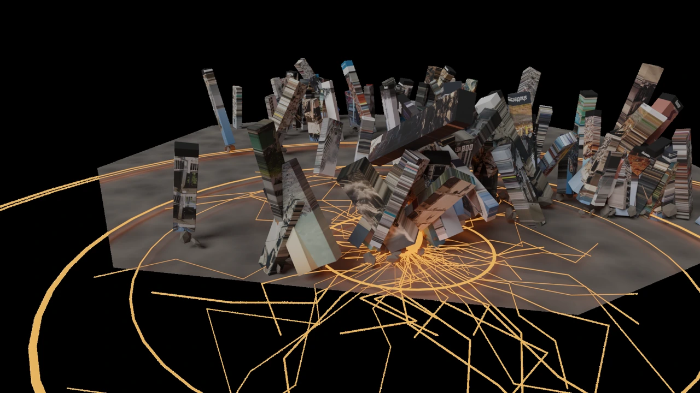

# 地震：数据转译

CLIP、文本向量与多源数据融合驱动空间生成。

**[完整设计案例](https://xiongzhiyuan-portfolio.pages.dev/zh/work/earthquake/) · [求职作品总入口](https://github.com/Zhiyuan-Xiong/xiongzhiyuan-portfolio)**

## 项目目标

以地震为主题，将图像中的视觉特征、文本中的叙事信号与地球物理记录转化为可计算的设计变量。在 Jupyter 中完成采集、清洗、分析与融合，再用 Python 将这些变量映射为 Blender 的建筑碎片、地表裂隙与动态场景，最终在 Processing 中转化为粒子、波纹与实时反馈。

## 我的贡献

Python 数据处理、参数映射与空间可视化

完成阶段：多源分析、程序建模与实时可视化

现有产出：Jupyter 分析、特征与聚类图、数据映射 CSV、Blender 生成模型与 Processing 动态反馈

## AI 与制作工作流

### 1. 多源采集

结合 USGS 地震记录、地震相关图像和新闻文本，建立可追溯的数据输入。

### 2. AI 与机器学习表示

融合 Notebook 包含 CLIP 图像向量、SentenceTransformer 文本向量，以及 TF-IDF、K-means、PCA 和标准化。代码保留对应模型与数据处理过程。

### 3. 跨模态融合

对图像、文本与地球物理变量进行对齐、归一化和融合，生成 final_fusion_data.csv 与设计映射表。

### 4. 从数据到空间

通过 Python 映射空间生成参数，在 Blender 与 Processing 中形成空间结构和动态反馈。此仓库中的 Notebook 记录第一阶段，作品集展示后续空间与交互成果。

### 5. 人工判断与证据

人工定义变量含义、映射规则和视觉结果。原研究代码、CSV 输出、案例图与交互影像分层保存，不把预训练模型推理表述为自行训练模型。

## 仓库内容

| 内容 | 入口 |
| --- | --- |
| 图像采集与视觉特征 | [earthquake photos scraping.ipynb](earthquake%20photos%20scraping.ipynb) |
| 新闻文本与语义处理 | [earthquake news scraping.ipynb](earthquake%20news%20scraping.ipynb) |
| 多模态融合工作流 | [earthquake_disaster_fusion_workflow.ipynb](earthquake_disaster_fusion_workflow.ipynb) |
| 融合数据 | [final_fusion_data.csv](final_fusion_data.csv) |
| 设计映射 | [design_mapping_table.csv](design_mapping_table.csv) |
| 案例与空间视觉资料 | [portfolio/](portfolio/) |

## 阅读顺序

1. 阅读图像与新闻采集 Notebook，理解各类特征和处理方式。
2. 阅读融合 Notebook，查看对齐、标准化、向量表示和空间指标的计算。
3. 对照 CSV 输出与设计映射表。
4. 在在线案例中查看 Blender 空间生成与 Processing 动态反馈。

## 数据来源与范围

地球物理数据来源为 [USGS 地震数据集](https://www.kaggle.com/datasets/usgs/earthquake-database)。图像、新闻与融合数据的来源和过程保留在原 Notebook 与代码中。模型使用预训练表示，具体配置以代码为准。

当前研究仓库主要记录数据采集、分析与融合阶段；后续原生工程仍沿用原项目的 [完整材料入口](https://liveuclac-my.sharepoint.com/:f:/g/personal/ucbvz94_ucl_ac_uk/IgBhQGdm-1IfSqVe3db81iSOASuGqH7bbghzayAqKxJ76Cw?e=2NrSCx)。

## 署名与使用

作品素材用于个人设计展示。协作项目以案例中的职责说明为准；字体、引擎和第三方资料遵循各自授权。未经许可，不将作品素材用于转载或商业用途。
