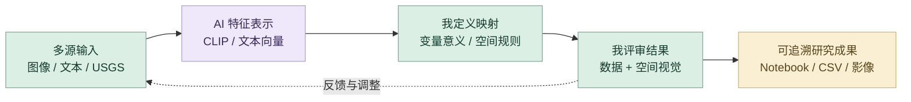
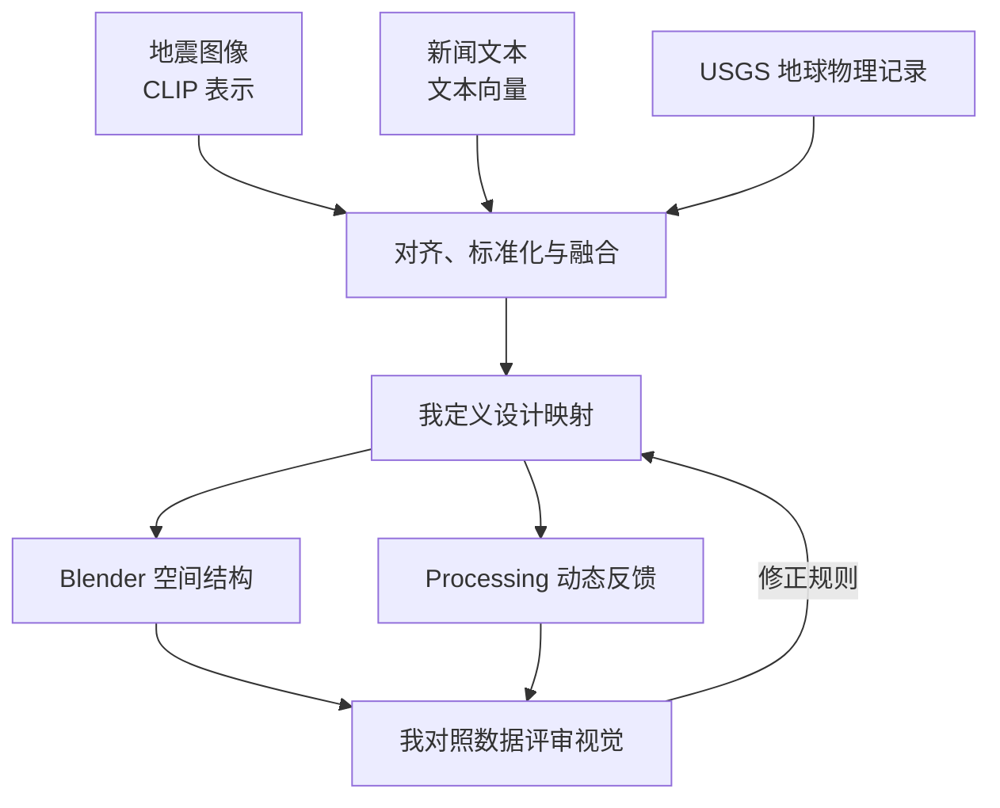

# 地震：数据转译｜详细 AI 设计工作流

让 AI 提取图像与文本中的可计算表示，再由我定义变量的设计意义与空间映射。重点是数据来源、跨模态对齐、映射解释与视觉结果之间的关系。

## 策略图

## 工具怎样分工

Jupyter 与 Python 承担采集、清洗、标准化与融合；CLIP 和 SentenceTransformer 提供预训练向量；Blender 与 Processing 承担空间和动态视觉。当前数字展示由 Codex 辅助组织。

## 1. 从设计问题确定数据任务

围绕地震如何转化为空间经验，拆分图像视觉、新闻叙事和地球物理三个输入。先明确想表达的空间变化，再决定需要收集与计算哪些变量。

## 2. 多渠道采集与来源核对

结合 USGS 地震记录、地震图像与新闻文本，保留 Notebook 中的采集和处理路径。分别检查不同来源的字段与含义，再进入后续分析。

## 3. AI 解析多模态信息

在现有 Notebook 中使用 CLIP 图像向量与 SentenceTransformer 文本向量，结合 TF-IDF、K-means、PCA 和标准化组织数据表示。这里使用预训练模型推理与分析。

## 4. 我组织融合与变量意义

对图像、文本和地球物理变量进行对齐与归一化，再建立融合数据。数值之间的对应关系需要由我解释，不能把模型输出直接等同于设计结论。

## 5. 建立可解释的空间映射

把融合结果转换为设计映射表，利用 Python 连接 Blender 的建筑碎片、裂隙与空间参数，并延伸到 Processing 的粒子与波纹。映射规则由我定义。

## 6. 用数据和视觉双重评审

同时查看特征、聚类、映射 CSV 和空间结果：数值变化是否对应预期的形态变化，视觉是否能够传达主题。根据问题重新调整分析或映射规则。

## 7. 回到对话、检索与代码迭代

将变量解释、代码理解与展示问题重新拆成具体任务，通过 AI 对话辅助组织说明，由 Codex 辅助当前案例呈现。研究代码、数据分析与空间成果分别保留，便于追溯。

## 8. 形成可检查的研究交付

交付原始 Notebook、CSV、融合与映射记录、空间图像和动态视觉。当前仓库主要完整记录数据阶段；后续原生工程仍沿用案例中的完整材料入口。

## 审美与专业质量

| 质量维度 | 我如何控制 | 可查看产出 |
| --- | --- | --- |
| **数据可信** | 核对字段、来源和处理路径，对不同模态做对齐与标准化。 | 可追溯的 Notebook 和 CSV |
| **专业解释** | 由我定义变量的含义与空间映射规则。 | 可检查的设计映射表 |
| **视觉表达** | 将空间结果与原始变量对照，检查层次和主题表达。 | 三维空间与动态视觉资料 |

## 迭代路线

## 过程证据

[多模态融合 Notebook](earthquake_disaster_fusion_workflow.ipynb) · [设计映射表](design_mapping_table.csv) · [融合数据](final_fusion_data.csv) · [聚类与数据分析](portfolio/media/earthquake/fusion-clusters.webp) · [空间视觉结果](portfolio/media/earthquake/spatial-detail.webp)

[项目总览](README.md) · [完整 AI 设计方法](https://github.com/Zhiyuan-Xiong/xiongzhiyuan-portfolio/blob/main/docs/AI设计工作流.md)
