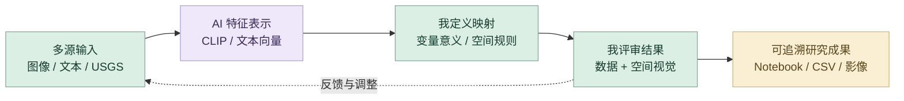
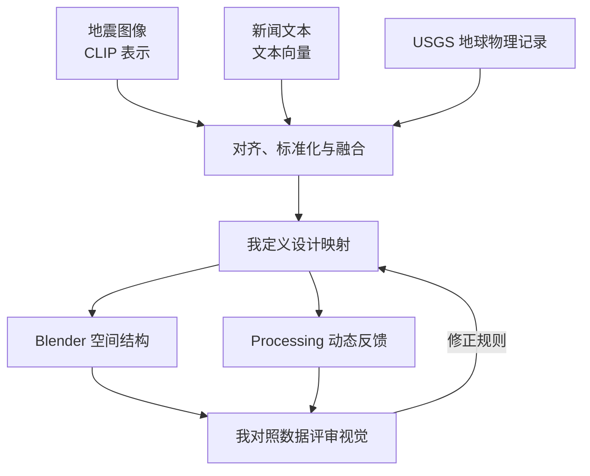

# 地震：数据转译｜详细 AI 设计工作流

让 AI 提取图像与文本中的可计算表示，再由我定义变量的设计意义与空间映射。重点是数据来源、跨模态对齐、映射解释与视觉结果之间的关系。

## 策略图

## 工具怎样分工

Jupyter 与 Python 承担采集、清洗、标准化与融合；CLIP 和 SentenceTransformer 提供预训练向量；Blender 与 Processing 承担空间和动态视觉。当前数字展示由 Codex 辅助组织。

## 指令与任务组织

我先用完整的任务说明建立上下文：交代项目目标、参考资料、审美方向、实现约束、输出格式与验收标准，让 ChatGPT 和 Codex 理解要完成什么。得到初步方案或原型后，我再以精准的短指令逐轮控制修改，明确本轮改什么、保留什么，并对照实际结果继续判断。**完整指令建立方向，短指令控制细节，专业判断决定交付。**

## 八阶段输入与输出

| 阶段 | 输入 | AI 协作与我的控制 | 输出与验收 |
| --- | --- | --- | --- |
| **1. 灵感发散** | 地震图像、新闻、USGS 数据与主题 | 对话辅助理解研究问题和代码思路；我定义数据如何服务灾后空间表达 | 研究问题；明确模态与设计目标 |
| **2. 多渠道检索** | 不同模态的原始数据和资料 | 辅助整理模型、字段和处理路径；我核对来源、样本关联与变量含义 | 输入清单；不把来源差异直接混合 |
| **3. 个人思维组织** | 原始字段、图像与文本 | Notebook 组织清洗和分析；我确定对齐方式、标准化与处理顺序 | 可检查输入；追溯来源与处理 |
| **4. AI 辅助方案** | 对齐数据与分析问题 | CLIP／SentenceTransformer 提取表示；我选择分析路线并解释特征的作用 | 向量与分析方案；区分推理和训练 |
| **5. 原型实现** | 向量、地球物理变量与融合数据 | Python 组织聚类、降维和映射输入；我定义变量到尺度、碎片等空间规则 | 融合 CSV 与映射表；核对字段对应 |
| **6. 迭代与测试** | CSV、聚类结果、空间图像 | 辅助检查代码和组织结果说明；我同时评审数据关系与空间可读性 | 比较结果；检查变量是否按规则变化 |
| **7. 反馈与再检索** | 异常字段、映射偏差或表达问题 | Chat 辅助解释，代码任务交给 Codex；数据问题回处理，空间问题回人工映射 | 修订说明或规则；再次对照结果 |
| **8. 精修与交付** | Notebook、CSV、视觉与案例 | 整理研究和数字呈现入口；我核对原研究文件与可追溯证据 | 原始代码、融合数据、映射与空间资料 |

## 精选决策：把模型表示转成可解释的设计规则

CLIP 和文本向量提供不同模态的表示；空间设计仍由我组织变量意义与映射。每轮判断同时对照数据和视觉，保证可以说明为何形成这样的空间。

| 输入证据 | 我的判断与控制 | 输出证据 |
| --- | --- | --- |
| 图像、文本和 USGS 字段 | 先对齐与标准化，再组织融合关系 | `final_fusion_data.csv` |
| 融合变量和设计意图 | 定义 `data_variable → mapping_rule → design_effect` | `design_mapping_table.csv` |
| 映射表与空间图像 | 检查尺度、碎片、旋转等结果是否对应规则 | 数据与空间视觉对照 |

这里使用预训练模型进行推理和分析；Notebook 与 CSV 保留原研究内容。

## 审美与专业质量

| 质量维度 | 我如何控制 | 可查看产出 |
| --- | --- | --- |
| **数据可信** | 核对字段、来源和处理路径，对不同模态做对齐与标准化。 | 可追溯的 Notebook 和 CSV |
| **专业解释** | 由我定义变量的含义与空间映射规则。 | 可检查的设计映射表 |
| **视觉表达** | 将空间结果与原始变量对照，检查层次和主题表达。 | 三维空间与动态视觉资料 |

## 迭代路线

## 过程证据

[多模态融合 Notebook](earthquake_disaster_fusion_workflow.ipynb) · [设计映射表](design_mapping_table.csv) · [融合数据](final_fusion_data.csv) · [聚类与数据分析](portfolio/media/earthquake/fusion-clusters.webp) · [空间视觉结果](portfolio/media/earthquake/spatial-detail.webp)

[项目总览](README.md) · [完整 AI 设计方法](https://github.com/Zhiyuan-Xiong/xiongzhiyuan-portfolio/blob/main/docs/AI设计工作流.md)
